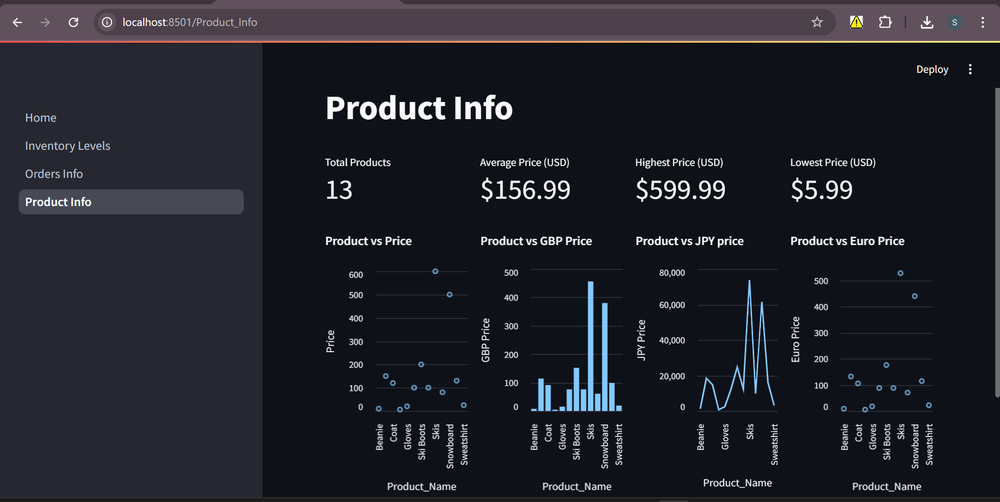
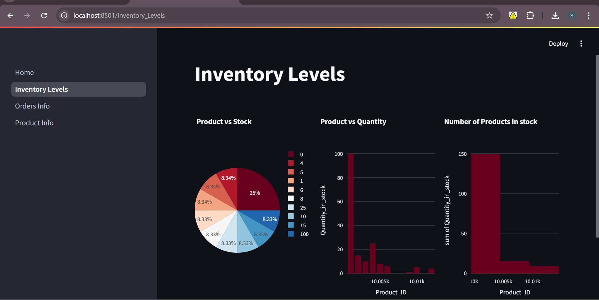

# 🏂 Maven Ski Shop Dashboard

An interactive analytics dashboard built using Streamlit, showcasing product, inventory, and sales insights from a ski shop dataset.

## 📊 Features

- 📦 Product metrics and price analysis
- 🏬 Inventory stock charts (bar, pie, histogram)
- 🛒 Customer order analysis and visualizations

## 🔧 Tools Used

- Streamlit
- Plotly
- Altair
- Pandas
- Excel (Data Source)

## 📷 Screenshots

### Product Info Page

### Inventory Levels

### Orders Info

## 📁 Dataset

The Excel file (`maven_ski_shop_data.xlsx`) contains:
- Item_Info
- Inventory_Levels
- Orders_Info

## 🚀 Run the App
streamlit run Home.py

